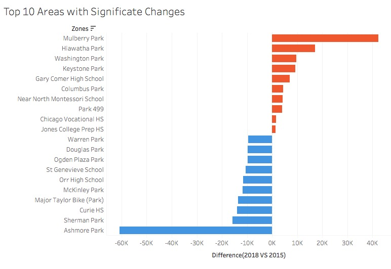
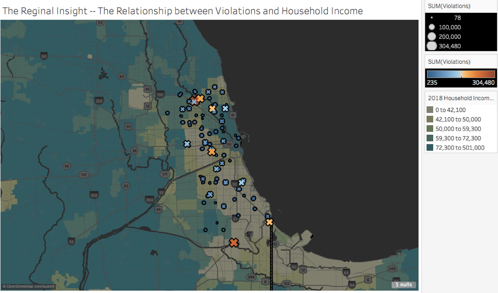

# Report of Chicago's Automated Speed Enforcement Program

## 1. Summary

The data is about the Children’s Safety Zone Program from the City of Chicago government site[(Original Dataset)](https://data.cityofchicago.org/Transportation/Speed-Camera-Violations/hhkd-xvj4
). This program is aiming to enhance safety for children and all residents in safety zones. 
The dataset reflects the daily volume of violations that have occurred in Children's Safety Zones for each camera.It is from July 2014 until Apr 2019, minus the most recent 14 days. Each row represents one violation caught by one camera.
The snapshot for the data:

This documentation is the report for the mayor of Chicago. The goal is to summarize the effect of this program and suggest further improvements. 

## 2. Developing Process

### 1.	Data Exploration
•	Literature preparation: Search documents for this program and the demographic information of Chicago

•	Data preparation: Download the data from Chicago government websites, merge the useful datasets and aggregate the demographic features to the final dataset using Python and Excel

•	Using Tableau to visualize the final dataset into five different visualization works, the works are from different aspects of the data, this helps us better understand the data

### 2.	First Version
•	Find the three interesting aspects from five data exploration works

•	Document the ‘making-of’ to the Mayor of Chicago

•	Provide the research evidence to prove my argument

•	Suggestions and Limitations

### 3.	Final Version
•	Refine the first version of visualizations

•	A dashboard to illustrate my findings

•	Documentation of this whole project

## 3.  Important Findings

### 1.The program efficiently decreasing the violations in the Children’s Safety Zone

           
Research Question

           
Content 1 Content 1 Content 1 Content 1 Content 1

         

When a new program is launched, the most important thing is to figure out is whether it truly helped enhance the safety of children and all residents in safety zones. Thus, this finding can help us decide whether we should keep putting money and efforts into this program. 

           
Data Exploration

           
Content 1 Content 1 Content 1 Content 1 Content 1

         

This is a visualization of the violations caught by cameras across the year.
This visualization shows from 2014 to 2019, the change in the average number of violations caught by the cameras. I used average rather than sum is because the incomplete of data for 2014 and 2019. Besides, there is an average line with a 95% confidence interval for reference. The colors represent different years.
I found it is obviously a decreasing trend for the number of violations in the safety areas. The result is plausible. 

           
First Version

           
Content 1 Content 1 Content 1 Content 1 Content 1

         

We can see an obviously decreasing in violations over the years. But, there is still something I should improve for the Data Exploration visualization.

1.	The average line is a bit of confusing and meaningless here. Thus, I deleted this line.
2.	The title was “Increasing? Or Decreasing”, it seems more likely to be accepted by journal readers, not for the Mayor, so I also changed the title to “Violations Trend across Years” to be more official.
3.	The colors are reduced to make it simple and easy to understand.

           
Final Version

           
Content 1 Content 1 Content 1 Content 1 Content 1

         

Does a bar graph the best way to prove my argument because we just want to see the trend of decreasing? 
From Tufte’s Principles of Design, we should maximize the data-ink ratio. The only thing we want to emphasise it the trend which in this case is the line change over the years. The bar may increase the unnecessary use of the space thus decrease the data-ink ratio. (Tufte,1986)(Plotly,2017)

Thus, I make some improvements in my final version:
1.	Changed the bar to the line charts to maximizing the data-ink ratio
2.	Added a trend line to better illustrate the decreasing and decrease the opacity of the original line to highlight the trend line, meanwhile, show the reliable of our analysis
3.	Added caption to describe the visualization
4.	Added filter to exclude the null values and show violations interactive with years
5.	Cleaned the grid in the background since the line chart doesn’t need the reference grid
6.	Bolded the title for better use in dashboard in the future

           
Argument with Additional analysis

           
Content 1 Content 1 Content 1 Content 1 Content 1

         

I am curious about whether the program enhanced safety in the safety zone? I found some statistic comparisons from the Chicago government official site.

The results show that the fatal or serious injury crashes decreased 9% near speed cameras, compared to 6% increase citywide and overall crashes have increased 1% in the automated speed enforcement locations compared to a 21% increase in crashes citywide from 2012-13 to 2014-16 period[(Citation)](https://www.chicago.gov/content/dam/city/depts/cdot/CSZ/ASE_CrashAnalysisWriteUp_10_10_18.pdf).
Then I found another resource --List of Activated Speed Cameras and Enforcement Schedule from Chicago government website[(Data Source)]( https://www.chicago.gov/content/dam/city/depts/cdot/Red%20Light%20Cameras/2018/Chicago_Active_Camera_Schedule_090518.pdf
). I merged this dataset with my original dataset by Camera ID. In this dataset, I summarized the new cameras launching year as follow:

From the research and my final visualization, we can conclude that this program is effective because the new cameras are increasing, while the violations caught by cameras are decreasing.
These data provide strong support for my visualization’s augment—The Children’s Safety Zone Program is essential and useful, it helps to warn the drivers to obey the traffic rules for speed as well as protect bicycle pedestrian from injured by speed violations.

### 2. Areas with Significate Changes

           
Research Question

           
Content 1 Content 1 Content 1 Content 1 Content 1

         

We already know that this program has a positive impact on reducing speed violation, the next step is to find the impact on different areas to see how can we improve this program.

           
Data Exploration 

           
Content 1 Content 1 Content 1 Content 1 Content 1

         

The data exploration graph roughly shows the top 10 address and Camera ID with the most number of violations, we found that it is a failure to use bubble charts because the size and color are confusing and meaningless. 

           
First Version 

           
Content 1 Content 1 Content 1 Content 1 Content 1

         

For the first version, we want to show the location more specifically, rather than use Camera ID & Address, we use zones because the cameras are settled by zones, if we found the zones that change significantly during the camera on-live period, we can change the budgets for those particular zones.
 I merged the original dataset with List of Activated Speed Cameras and Enforcement Schedule[(Data source)](https://www.chicago.gov/content/dam/city/depts/cdot/Red%20Light%20Cameras/2018/Chicago_Active_Camera_Schedule_090518.pdf) from the Chicago government to get the Zone information by Camera ID. And since I want to see the impact and change of camera in these zones. I added a **calculator field** to compute the difference on violations between 2015 and 2018. And I used a **Parameter** with **sets** to filter the top 10 increased zones as well as top 10 decreased zones. There are only two colors to distinguish increasing and decreasing.

           
Final Version 

           
Content 1 Content 1 Content 1 Content 1 Content 1

         

The first version gives us a basic understanding for the zones with significant changes during camera on-live years. However, we can refine this visualization better.
1.	Picked up the two zones with the most significant changes and highlight them
2.	Reduced the top 10 to 6 for each direction. The reason for this is only the top 1 zone have a great change (more than twice) comparing the other zones, besides, the graph is better fit the screen, the reader doesn’t need to scroll the screen to check the top 1 zone which they are most interested in. 
3.	Added Caption to describing the visualization
4.	Bolded the title for better use in dashboard

Argument with Additional analysis 

           
Content 1 Content 1 Content 1 Content 1 Content 1

         

         
We can find that in Mulberry Park, the violations increased dramatically. However, in Ashmore Park, the violations decreased significantly. 
The Chicago government site cited, “Further, the City is capping the locations where speed cameras can be installed to 20% of the 1,500 safety zone locations allowed by state law (approximately 300) “[(Citation)](https://www.chicago.gov/city/en/depts/cdot/supp_info/children_s_safetyzoneporgramautomaticspeedenforcement.html), 
From the results, we would recommend pausing the new installing of cameras in zones like Ashmore Park, because the number of cameras in those zones are already enough to catch the violations or warning the drivers. Instead, installing more in zones which have increased a lot in violations, especially Mulberry Park. These zones will catch more violations in the future and increasing government incomes. And investigate the reason for these changes between significant increasing and decreasing. 

### 3. Violation Insights by Generation

Research Question

           
Content 1 Content 1 Content 1 Content 1 Content 1

         

Now we already found out the zones with significant changes by the safety zone program, and we also know where should we put more efforts on. Another important thing is found the insights from the distribution of violations so we can take actions to prevent the violations.

Data Explaration 

           
Content 1 Content 1 Content 1 Content 1 Content 1

         

This is a map of violations with Household income plotted by Tableau:

However, we can’t see a clear relationship between Household income and violations, thus we can’t give useful advice.

First Version 

           
Content 1 Content 1 Content 1 Content 1 Content 1

         

I found the latest Census data of Chicago and merged it into my original dataset by Community Areas[(Data source)](https://datahub.cmap.illinois.gov/dataset/2010-census-data-summarized-to-chicago-community-areas/resource/b30b47bf-bb0d-46b6-853b-47270fb7f626). And I got the Races, Ethnicity, Ages and Household information for each community areas. 
I merged this dataset to the original dataset by community area number, and then aggregate the demographic features, for example, sum the male and female of ages under 18 years old as ‘Teenager’. And try to find the relationship with the number of violations.
Then I found the distribution of violation by Median Age shows some different finding. I  made bins for age to see which generation’s living area are most likely to have violations. The result is community areas which have a median age of 30 years old, are most likely to occur speed violations.

Final Version 

           
Content 1 Content 1 Content 1 Content 1 Content 1

         

For a better reading experience, I made some improvements:
1.	Highlighted the age of 30 because this is the age range that I want to make the argument
2.	Changed the title and add the caption to describe the visualization better
3.	Bolded the title

Argument 

           
Content 1 Content 1 Content 1 Content 1 Content 1

         

This result gives us a hint that we should educate more on these middle age areas to reduce the speed violations. And since the limitation of the data, we can’t get more demographic information about the drivers, I recommend including information of drivers who have violated the speed limit rules and launch a preventive education.

## 4.  Dashboard

First Version

           
Content 1 Content 1 Content 1 Content 1 Content 1

         

Final Version

           
Content 1 Content 1 Content 1 Content 1 Content 1

         

The improvements:
1.	Changed the layout of the dashboard, according to people’s reading habit (from left to right, from top to bottom) for better understanding
2.	Added a title for the dashboard
3.	Deleted some useless discretional box and only left the year filter box
4.	Added interactive actions—filter and apply it to selected sheets
5.	Added interactive actions—Go to Sheet, when the reader is viewing the violation trend over years graph, they can select to go to the reference sheet (New camera on-live summary)
6.	Added actions—Go to URL, the reader can view the whole project documentation in GitHub.
7.	Unified the colors of each graph, orange for highlight or increasing, blue for decreasing, grey for not important. 

## [Tableau Link for the final version](https://public.tableau.com/profile/nina.zou#!/vizhome/FinalVision/ViolationsTrendovertheYears)

## 5.Suggestions for Government focus in the future
1.	Continue the Children's Safety Zone Program & Automated Speed Enforcement yearly.
2.	Check the road signs/camera warnings in Mulberry Park. Investigate the reason for increasing/decreasing violations in those zones. Add new cameras near increasing zones rather than decreasing zones.
3.	Launch preventive education program in community areas with a median age of 30, including violation drivers’ information in the data collecting process

## References

1.	City of Chicago. (2018), Chicago Automated Speed Enforcement Camera Before and After Safety Impact Analysis. Retrieved from https://www.chicago.gov/content/dam/city/depts/cdot/CSZ/ASE_CrashAnalysisWriteUp_10_10_18.pdf
2.	City of Chicago. (2018). List of Activated Speed Cameras and Enforcement Schedule. Retrieved from https://www.chicago.gov/content/dam/city/depts/cdot/Red%20Light%20Cameras/2018/Chicago_Active_Camera_Schedule_090518.pdf
3.	City of Chicago. (2019). Children's Safety Zone Program & Automated Speed Enforcement. Retrieved fromhttps://www.chicago.gov/city/en/depts/cdot/supp_info/children_s_safetyzoneporgramautomaticspeedenforcement.html
4.	CMAP DATA HUB. (2015). 2010 Census Data Summarized to Chicago Community Area. Retrieved from https://datahub.cmap.illinois.gov/dataset/2010-census-data-summarized-to-chicago-community-areas/resource/b30b47bf-bb0d-46b6-853b-47270fb7f626

5.	Tufte, Edward R. 1986. The Visual Display of Quantitative Information. Cheshire, CT, USA: Graphics Press.
6.	Plotly. 2017. “Maximizing the Data-Ink Ratio in Dashboards and Slide Decks.” https://medium.com/@plotlygraphs/maximizing-the-data-ink-ratio-in-dashboards-and-slide-deck-7887f7c1fab.
 

