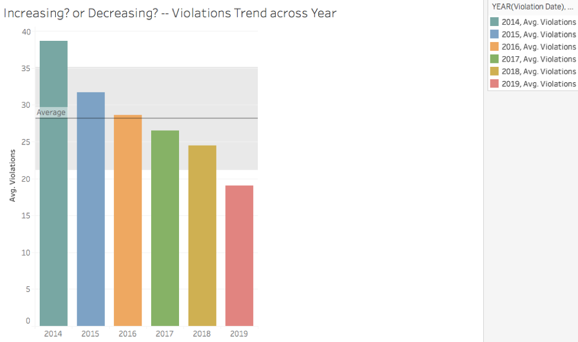
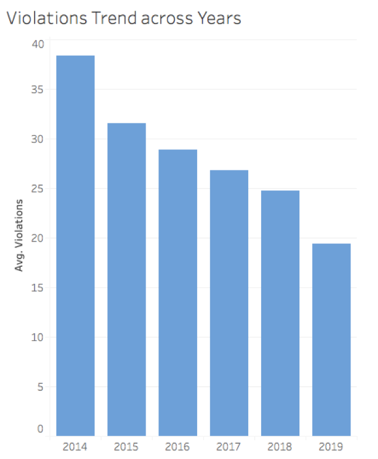
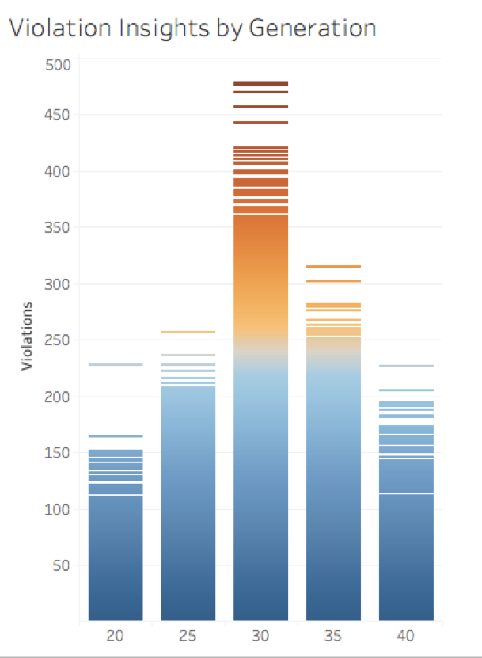
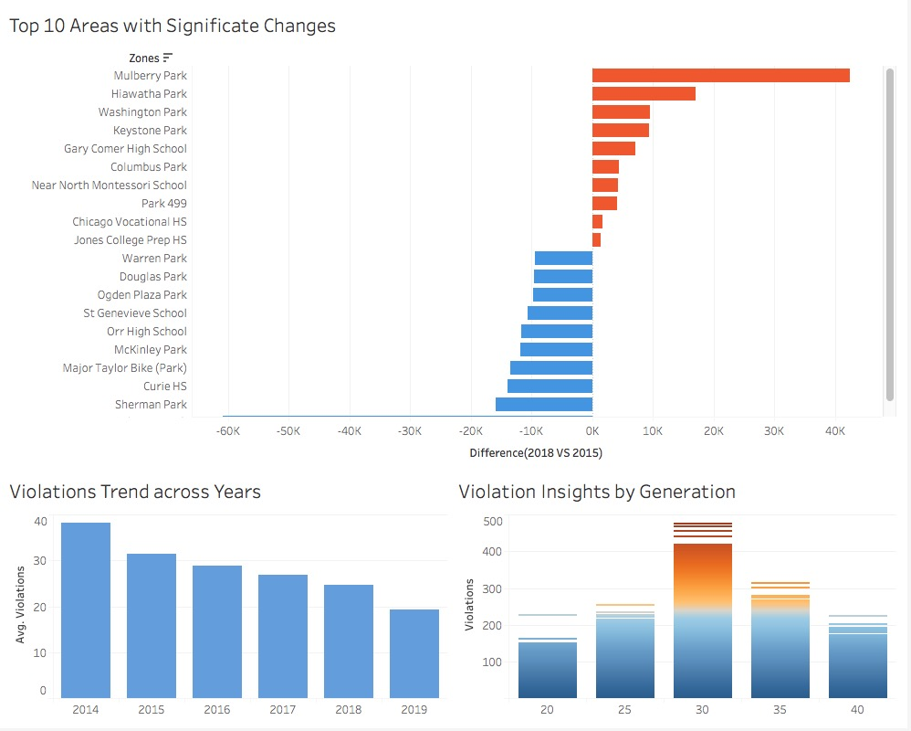

# Report of Chicago's Automated Speed Enforcement Program
## 1.	Summary 
The data is about the Children’s Safety Zone Program from the City of Chicago government site[(Original Dataset)](https://data.cityofchicago.org/Transportation/Speed-Camera-Violations/hhkd-xvj4
). This program is aiming to enhance safety for children and all residents in safety zones. The dataset reflects the daily volume of violations that have occurred in Children's Safety Zones for each camera. It is from July 2014 until Apr 2019, minus the most recent 14 days. Each row represents one violation caught by one camera.

The snapshot for the data:

## 2. Findings

### 1. Program efficiently decreasing the violations in the Children’s Safety Zone

When a new program is launched, the most important thing I want to figure out is whether it truly helped enhance the safety of children and all residents in safety zones.

Thus, I plot a visualization of the violations caught by cameras across the year. 

This visualization shows from 2014 to 2019, the change in an average number of violations caught by the cameras. I used average rather than sum is because the incomplete of data for 2014 and 2019. Besides, there is an average line with a 95% confidence interval for reference. The colors represent the different years for better reading.

I found it is obviously a decreasing trend for the number of violations in the safety areas. The result is plausible. The reason I chose the bar plot is that the it is the best way to get the trend across time and we can see the staged achievement for this program. 

Then, I am curious about whether the program enhanced the safety in the safety zone? I found some statistic comparisons from the Chicago government official site. 

The results show that the fatal or serious injury crashes decreased 9% near speed cameras, compared to 6% increase citywide and overall crashes have increased 1% in the automated speed enforcement locations compared to a 21% increase in crashes citywide from 2012-13 to 2014-16 period[(Citation)](https://www.chicago.gov/content/dam/city/depts/cdot/CSZ/ASE_CrashAnalysisWriteUp_10_10_18.pdf).

Then I found another resource --List of Activated Speed Cameras and Enforcement Schedule from Chicago government website[(Data Source)]( https://www.chicago.gov/content/dam/city/depts/cdot/Red%20Light%20Cameras/2018/Chicago_Active_Camera_Schedule_090518.pdf
). I merged this dataset with my original dataset by Camera ID. In this dataset, I summarized the new cameras launching year as follow:

However, there is still something I should improve for my first visualization. 
1.	The average line is a bit of confusing and meaningless here. Thus, I deleted this line. 
2.	The title was “Increasing? Or Decreasing”, it seems more likely to be accepted by journal readers, not for the Mayor, so I also changed the title to “Violations Trend across Years” to be more official.
3.	The colors are reduced to make it simple and easy to understand.

The final visualization is:

From the research and my final visualization, we can conclude that **this program is effective because the new cameras are increasing, however the violations caught by cameras are decreasing.**

These data provide strong support for my visualization’s augment—The Children’s Safety Zone Program is essential and useful, it helps to warn the drivers to obey the traffic rules for speed as well as protect bicycle pedestrian from injured by speed violations.

### 2. The Top 10 Areas with Significate Changes

We already know that this program has a positive impact on reducing speed violation, the next step is to find the impact on different areas to see how can we improve this program.

Firstly, I draw a graph to show the top 10 address and Camera ID with the most number of violations:

But I then noticed that it is better to give a more specific view of the zones because the cameras are set by zone, not just streets. And the size and color are confusing. 

I merged the original dataset with List of Activated Speed Cameras and Enforcement Schedule[(Data source)](https://www.chicago.gov/content/dam/city/depts/cdot/Red%20Light%20Cameras/2018/Chicago_Active_Camera_Schedule_090518.pdf) from Chicago government to get the Zone information. And since I want to see the impact and change of camera in these zones. I added a calculator field to compute the difference on violations between 2015 and 2018. And I used a Parameter with sets to filter the top 10 increased zones as well as top 10 decreased zones. There are only two colors to distinguish increasing and decreasing.

And as the government site cited, “Further, the City is capping the locations where speed cameras can be installed to 20% of the 1,500 safety zone locations allowed by state law (approximately 300) “[(Citation)](https://www.chicago.gov/city/en/depts/cdot/supp_info/children_s_safetyzoneporgramautomaticspeedenforcement.html), I would recommend installing more in Top 10 Zones with Red Color. These zones will catch more violations in the future and increasing government income.

### 3. Violation Insights by Generation

Now we already found out the zones with significant changes by the safety zone program, and we also know where should we put more efforts on. Another important thing is found the insights from the distribution of violations.

Firstly, I plotted a map of violations with Household income:

However, we can’t see a clear relationship between Household income and violations, thus we can’t give useful advice. 

Then, I found the lastest Census data of Chicago and merged it into my original dataset by Community Areas[(Data source)](https://datahub.cmap.illinois.gov/dataset/2010-census-data-summarized-to-chicago-community-areas/resource/b30b47bf-bb0d-46b6-853b-47270fb7f626). And I got the Races, Ethnicity, Ages and Household information for each community areas. And then I made bins for age to see which generation’s living area are most likely to have violations. The result is community areas which have a median age of 30 years old, are most likely to occur speed violations.

This result gives us a hint that we should educate more on these middle age areas to reduce the speed violations. And since the limitation of the data, we can’t get more demographic information about the drivers, I recommend including information of drivers who have violated the speed limit rules and launch a preventive education.

## 3. Dashboard

## [Tableau Link](https://public.tableau.com/profile/nina.zou#!/vizhome/FirstVision/Top10AreaswithSignificateChanges)

## 4.Suggestions for Government focus in the future

1.	Continue the Children's Safety Zone Program & Automated Speed Enforcement yearly.
2.	Check the road signs/camera warnings in Washington Park, Keystone Park, Gary Comer High School, Columbus Park, Near North Montessori School, Park 499, Chicago Vocational HS, Jones College Prep HS. Investigate the reason for increasing violations in those zones. Add new cameras near those zones.
3.	Launch preventive education program in community areas with a median age of 30, including violation drivers’ information in the data collecting process

## References

1. City of Chicago. (2018), Chicago Automated Speed Enforcement Camera Before and After Safety Impact Analysis. Retrieved from https://www.chicago.gov/content/dam/city/depts/cdot/CSZ/ASE_CrashAnalysisWriteUp_10_10_18.pdf

2. Cith of Chicago. (2018). List of Activated Speed Cameras and Enforcement Schedule. Retrieved from https://www.chicago.gov/content/dam/city/depts/cdot/Red%20Light%20Cameras/2018/Chicago_Active_Camera_Schedule_090518.pdf

3. City of Chicago. (2019). Children's Safety Zone Program & Automated Speed Enforcement. Retrieved from   https://www.chicago.gov/city/en/depts/cdot/supp_info/children_s_safetyzoneporgramautomaticspeedenforcement.html

4. CMAP DATA HUB. (2015). 2010 Census Data Summarized to Chicago Community Area. Retrieved from https://datahub.cmap.illinois.gov/dataset/2010-census-data-summarized-to-chicago-community-areas/resource/b30b47bf-bb0d-46b6-853b-47270fb7f626

